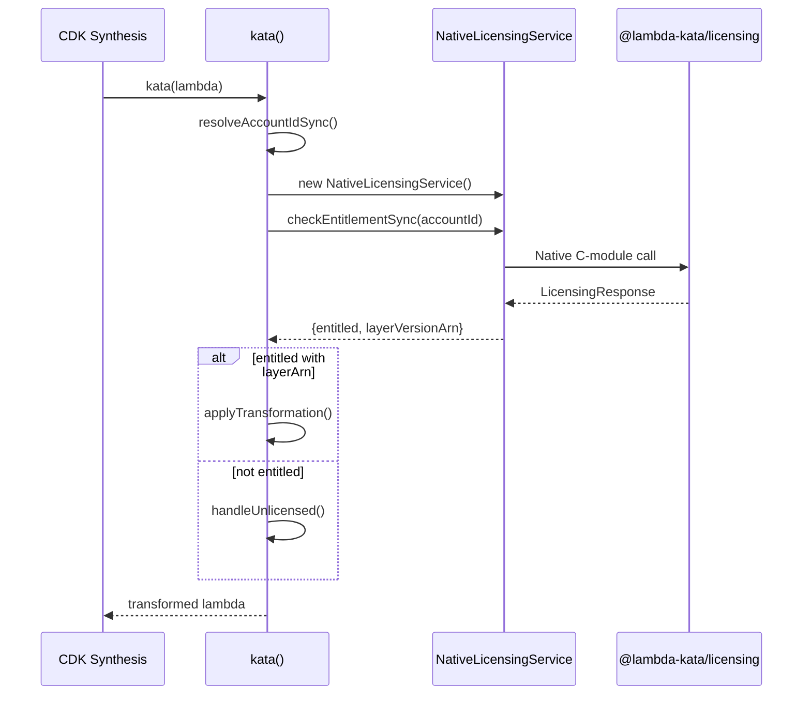

# Design Document: Remove Legacy Licensing

## Overview

This design describes the removal of legacy HTTP-based licensing code from the Lambda Kata CDK library. The goal is to simplify the architecture by eliminating unused code paths and ensuring all licensing is controlled exclusively through the native C-module `@lambda-kata/licensing`.

### Current State

The codebase currently has two licensing mechanisms:
1. **Native C-module** (`@lambda-kata/licensing`): Used in production via `NativeLicensingService.checkEntitlementSync()`
2. **Legacy HTTP service** (`src/licensing.ts`): `HttpLicensingService` class - NOT used in production
3. **Mock service** (`src/mock-licensing.ts`): `MockLicensingService` class - used only for testing

The `kata-wrapper.ts` contains internal testing interfaces (`KataWrapperInternalOptions`) that allow injecting custom licensing services, which creates potential security concerns and unnecessary complexity.

### Target State

After this refactoring:
- All licensing validation uses only `NativeLicensingService` from `@lambda-kata/licensing`
- No HTTP fallback mechanism exists
- Tests mock the native module directly via `jest.mock('@lambda-kata/licensing')`
- No internal interfaces allow bypassing licensing

## Architecture

### Component Diagram

```mermaid
graph TB
    subgraph "Before Refactoring"
        KW1[kata-wrapper.ts] --> NS1[NativeLicensingService]
        KW1 --> HS1[HttpLicensingService]
        KW1 --> MS1[MockLicensingService]
        HS1 --> LT1[src/licensing.ts]
        MS1 --> MT1[src/mock-licensing.ts]
    end
    
    subgraph "After Refactoring"
        KW2[kata-wrapper.ts] --> NS2[NativeLicensingService]
        NS2 --> NM2[@lambda-kata/licensing]
    end
```

### Data Flow



## Components and Interfaces

### Files to Delete

| File | Reason |
|------|--------|
| `src/licensing.ts` | Legacy HTTP licensing service, not used in production |
| `src/mock-licensing.ts` | Mock service for testing, replaced by jest.mock |
| `test/licensing.test.ts` | Tests for deleted HttpLicensingService |
| `test/mock-licensing.test.ts` | Tests for deleted MockLicensingService |

### Files to Modify

| File | Changes |
|------|---------|
| `src/kata-wrapper.ts` | Remove `KataWrapperInternalOptions`, remove `licensingService`/`syncLicensingService` params, remove imports from `./licensing` |
| `src/index.ts` | Remove exports of `LicensingService`, `HttpLicensingService`, `createLicensingService`, `kataWithAccountId` |
| `test/kata-wrapper.test.ts` | Replace `MockLicensingService` with `jest.mock('@lambda-kata/licensing')` |
| `test/kata-wrapper.property.test.ts` | Replace `MockLicensingService` with `jest.mock('@lambda-kata/licensing')` |
| `test/region-resolution.test.ts` | Replace `MockLicensingService` with `jest.mock('@lambda-kata/licensing')` |
| `test/kata-sync-transformation.test.ts` | Already uses mock interface, update to use jest.mock |

### Interface Changes

#### Removed: KataWrapperInternalOptions

```typescript
// DELETED - This interface is removed entirely
export interface KataWrapperInternalOptions extends KataWrapperOptions {
  licensingService?: LicensingService;
  syncLicensingService?: NativeLicensingServiceInterface;
}
```

#### Modified: kataWithAccountId

```typescript
// Before: Accepted licensingService parameter
export async function kataWithAccountId<T>(
  lambda: T,
  accountId: string,
  region: string,
  props?: KataWrapperInternalOptions,  // Allowed licensingService injection
): Promise<KataResult>

// After: No longer exported, uses only NativeLicensingService
// Function becomes internal-only, not exported from index.ts
```

#### Modified: performKataTransformationSync

```typescript
// Before: Accepted syncLicensingService via props
function performKataTransformationSync<T>(
  lambda: T,
  scope: Construct,
  props?: KataWrapperInternalOptions,  // Allowed syncLicensingService injection
): KataResult

// After: No injection point, always uses NativeLicensingService
function performKataTransformationSync<T>(
  lambda: T,
  scope: Construct,
  props?: KataWrapperOptions,  // Standard options only
): KataResult
```

### Test Mocking Strategy

Tests will use `jest.mock('@lambda-kata/licensing')` to control licensing behavior:

```typescript
// At top of test file
jest.mock('@lambda-kata/licensing', () => ({
  NativeLicensingService: jest.fn().mockImplementation(() => ({
    checkEntitlementSync: jest.fn().mockReturnValue({
      entitled: true,
      layerVersionArn: 'arn:aws:lambda:us-east-1:999999999999:layer:LambdaKata:1',
    }),
  })),
}));

// In test setup
import { NativeLicensingService } from '@lambda-kata/licensing';
const mockNativeLicensingService = NativeLicensingService as jest.MockedClass<typeof NativeLicensingService>;

// Configure for specific test
beforeEach(() => {
  mockNativeLicensingService.mockImplementation(() => ({
    checkEntitlementSync: jest.fn().mockReturnValue({
      entitled: true,
      layerVersionArn: 'arn:aws:lambda:us-east-1:999999999999:layer:LambdaKata:1',
    }),
  }));
});
```

## Data Models

### LicensingResponse (Unchanged)

The `LicensingResponse` type in `src/types.ts` remains unchanged and continues to be exported:

```typescript
export interface LicensingResponse {
  entitled: boolean;
  layerArn?: string;
  layerVersionArn?: string;
  message?: string;
  expiresAt?: string;
  nodeVersion?: string;
  architecture?: string;
}
```

### Public API Surface (After Refactoring)

Exports from `src/index.ts`:

| Export | Status |
|--------|--------|
| `kata` | Kept |
| `kataWithAccountId` | **Removed** |
| `applyTransformation` | Kept |
| `handleUnlicensed` | Kept |
| `isKataTransformed` | Kept |
| `getKataPromise` | Kept |
| `KataWrapperOptions` | Kept |
| `KataResult` | Kept |
| `LicensingResponse` | Kept (from types.ts) |
| `LicensingService` | **Removed** |
| `HttpLicensingService` | **Removed** |
| `createLicensingService` | **Removed** |


## Correctness Properties

*A property is a characteristic or behavior that should hold true across all valid executions of a system—essentially, a formal statement about what the system should do. Properties serve as the bridge between human-readable specifications and machine-verifiable correctness guarantees.*

### Property 1: Native Licensing Module Usage

*For any* Lambda function passed to `kata()`, the system shall invoke `NativeLicensingService.checkEntitlementSync()` from `@lambda-kata/licensing` to validate entitlement. No other licensing mechanism shall be used.

**Validates: Requirements 2.4, 4.1**

### Property 2: Entitled Transformation

*For any* licensing response where `entitled === true` and `layerVersionArn` is present, the kata wrapper shall apply the transformation (change runtime to Python 3.12, set handler to Lambda Kata handler, attach the layer).

**Validates: Requirements 4.2**

### Property 3: Non-Entitled Handling

*For any* licensing response where `entitled === false`, the kata wrapper shall:
1. NOT apply any transformation to the Lambda function
2. Emit a warning annotation on the Lambda construct
3. Return `{ transformed: false }` in the result

**Validates: Requirements 4.3**

### Property 4: Error Resilience

*For any* error thrown by `NativeLicensingService.checkEntitlementSync()`, the kata wrapper shall treat the account as unlicensed (equivalent to `entitled: false`) and handle according to Property 3.

**Validates: Requirements 4.4**

## Error Handling

### Native Module Errors

When `NativeLicensingService` throws an error:
1. Log error message to console with `[Lambda Kata]` prefix
2. Create a `LicensingResponse` with `entitled: false` and descriptive message
3. Call `handleUnlicensed()` to emit warning or fail based on `unlicensedBehavior` option
4. Return `{ transformed: false }` result

```typescript
try {
  const nativeService = new NativeLicensingService();
  licensingResponse = nativeService.checkEntitlementSync(accountId);
} catch (nativeError) {
  const errorMessage = nativeError instanceof Error ? nativeError.message : 'Unknown error';
  console.error(`[Lambda Kata] Native licensing module error: ${errorMessage}`);
  
  licensingResponse = {
    entitled: false,
    message: `Native licensing module unavailable: ${errorMessage}. Please ensure the native module is built.`,
  };
}
```

### Account Resolution Errors

When `resolveAccountIdSync()` fails:
1. Create `LicensingResponse` with `entitled: false`
2. Call `handleUnlicensed()` 
3. Return `{ transformed: false, accountId: 'unknown' }`

### Unlicensed Behavior Options

| Option | Behavior |
|--------|----------|
| `'warn'` (default) | Emit CDK warning annotation, continue synthesis |
| `'fail'` | Throw error, fail CDK synthesis |

## Testing Strategy

### Dual Testing Approach

- **Unit tests**: Verify specific examples, edge cases, and error conditions
- **Property tests**: Verify universal properties across all inputs using fast-check

### Test Mocking Pattern

All tests that need to control licensing behavior will use `jest.mock('@lambda-kata/licensing')`:

```typescript
// test/kata-wrapper.test.ts
jest.mock('@lambda-kata/licensing', () => ({
  NativeLicensingService: jest.fn().mockImplementation(() => ({
    checkEntitlementSync: jest.fn(),
  })),
}));

import { NativeLicensingService } from '@lambda-kata/licensing';

describe('kata-wrapper', () => {
  const mockCheckEntitlementSync = jest.fn();
  
  beforeEach(() => {
    jest.clearAllMocks();
    (NativeLicensingService as jest.Mock).mockImplementation(() => ({
      checkEntitlementSync: mockCheckEntitlementSync,
    }));
  });

  it('should transform when entitled', () => {
    mockCheckEntitlementSync.mockReturnValue({
      entitled: true,
      layerVersionArn: 'arn:aws:lambda:us-east-1:999999999999:layer:LambdaKata:1',
    });
    
    // ... test code
  });

  it('should not transform when not entitled', () => {
    mockCheckEntitlementSync.mockReturnValue({
      entitled: false,
      message: 'Not entitled',
    });
    
    // ... test code
  });
});
```

### Property-Based Testing Configuration

- Library: fast-check
- Minimum iterations: 100 per property test
- Tag format: **Feature: remove-legacy-licensing, Property {number}: {property_text}**

### Test Files to Delete

| File | Reason |
|------|--------|
| `test/licensing.test.ts` | Tests deleted `HttpLicensingService` |
| `test/mock-licensing.test.ts` | Tests deleted `MockLicensingService` |

### Test Files to Modify

| File | Changes |
|------|---------|
| `test/kata-wrapper.test.ts` | Replace `MockLicensingService` imports with `jest.mock('@lambda-kata/licensing')` |
| `test/kata-wrapper.property.test.ts` | Replace `MockLicensingService` with jest.mock pattern |
| `test/region-resolution.test.ts` | Replace `MockLicensingService` with jest.mock pattern |
| `test/kata-sync-transformation.test.ts` | Update mock implementation to use jest.mock |

### Property Test Implementation

Each correctness property will be implemented as a property-based test:

```typescript
// Feature: remove-legacy-licensing, Property 1: Native Licensing Module Usage
describe('Property 1: Native Licensing Module Usage', () => {
  it('should always use NativeLicensingService for any Lambda function', () => {
    fc.assert(
      fc.property(
        arbLambdaConfig(),
        (config) => {
          // Setup
          const { stack } = createTestStack('123456789012');
          const lambda = createTestLambda(stack, 'TestFunction', config);
          
          // Act
          kata(lambda);
          
          // Assert: NativeLicensingService was instantiated and called
          expect(NativeLicensingService).toHaveBeenCalled();
          expect(mockCheckEntitlementSync).toHaveBeenCalledWith('123456789012');
        }
      ),
      { numRuns: 100 }
    );
  });
});
```
