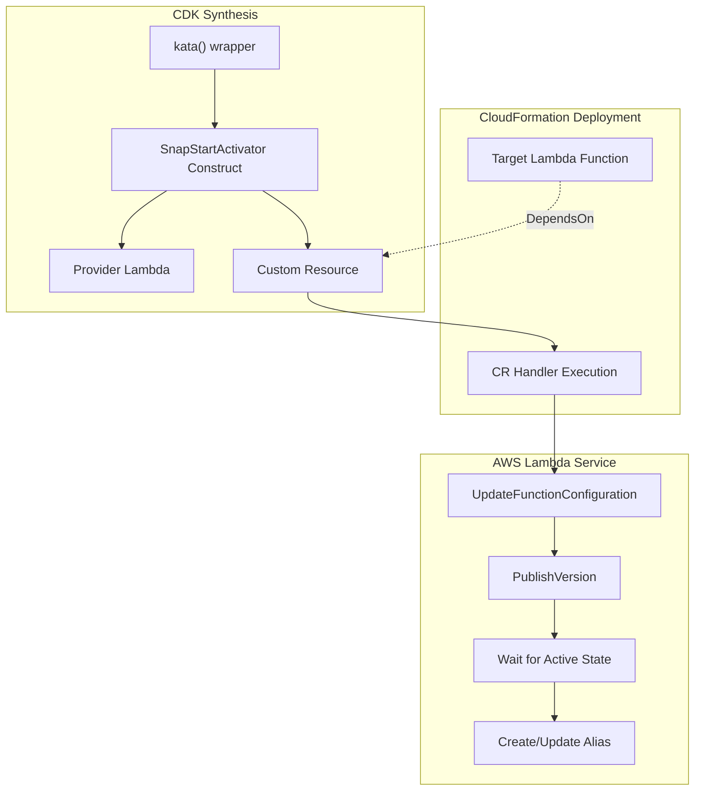
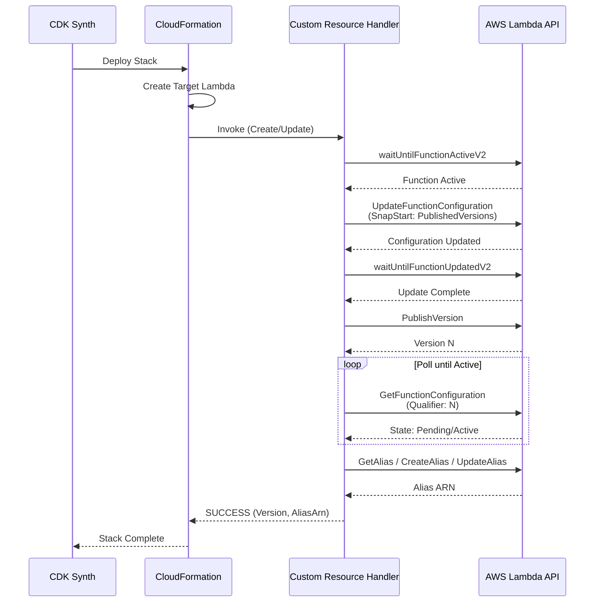

# Design Document: SnapStart Activation

## Overview

This design document describes the implementation of SnapStart activation and readiness waiting for Lambda Kata CDK deployments. The system ensures that Python Lambda functions transformed by `kata()` have SnapStart enabled and are ready for traffic immediately after `cdk deploy` completes, preventing SnapStartNotReadyException errors on first invocations.

The implementation uses a CDK Custom Resource pattern where a Lambda-backed custom resource executes during CloudFormation deployment to:
1. Enable SnapStart configuration on the target function
2. Publish a new version (triggering snapshot creation)
3. Wait for the snapshot to become ready
4. Create/update an alias pointing to the ready version

## Architecture



### Deployment Sequence



## Components and Interfaces

### SnapStartActivator Construct

The main CDK construct that creates the Custom Resource infrastructure.

```typescript
/**
 * Properties for SnapStartActivator construct.
 */
interface SnapStartActivatorProps {
  /**
   * The Lambda function to enable SnapStart on.
   */
  targetFunction: IFunction;

  /**
   * The alias name to create/update.
   * @default 'kata'
   */
  aliasName?: string;

  /**
   * Maximum time to wait for snapshot creation in seconds.
   * @default 180 (3 minutes)
   */
  snapshotTimeoutSeconds?: number;
}

/**
 * CDK Construct that enables SnapStart on a Lambda function after deployment.
 */
class SnapStartActivator extends Construct {
  /** The alias name that was created/updated */
  readonly aliasName: string;
  
  /** The Custom Resource that manages SnapStart activation */
  readonly resource: CustomResource;
  
  /** The version number created by SnapStart activation (CloudFormation attribute) */
  readonly versionRef: string;
  
  /** The alias ARN created by SnapStart activation (CloudFormation attribute) */
  readonly aliasArnRef: string;
}
```

### Custom Resource Handler

The Lambda function that executes during CloudFormation deployment.

```typescript
/**
 * Custom Resource event from CloudFormation.
 */
interface CustomResourceEvent {
  RequestType: 'Create' | 'Update' | 'Delete';
  ResourceProperties: {
    FunctionName: string;
    AliasName?: string;
    Timestamp?: string;
  };
  PhysicalResourceId?: string;
  // ... standard CloudFormation fields
}

/**
 * Result of SnapStart activation.
 */
interface SnapStartActivationResult {
  version: string;
  aliasName: string;
  aliasArn: string;
  optimizationStatus: string;
}

/**
 * Activates SnapStart on a Lambda function.
 */
async function activateSnapStart(
  lambdaClient: LambdaClient,
  functionName: string,
  config?: SnapStartActivatorConfig
): Promise<SnapStartActivationResult>;
```

### Provider Function Configuration

```typescript
/**
 * Provider Lambda function configuration.
 */
interface ProviderConfig {
  runtime: Runtime.NODEJS_18_X;
  handler: 'index.handler';
  timeout: Duration.seconds(snapshotTimeoutSeconds + 60);
  memorySize: 256;
  code: Code.fromInline(handlerCode);
}
```

## Data Models

### Custom Resource Properties

```typescript
/**
 * Properties passed to the Custom Resource.
 */
interface CustomResourceProperties {
  /** Name or ARN of the target Lambda function */
  FunctionName: string;
  
  /** Alias name to create/update */
  AliasName: string;
  
  /** Timestamp to force updates on each deployment */
  Timestamp: string;
}
```

### Custom Resource Response

```typescript
/**
 * Data returned by the Custom Resource handler.
 */
interface CustomResourceData {
  /** Published version number */
  Version: string;
  
  /** Alias name that was created/updated */
  AliasName: string;
  
  /** Full ARN of the alias */
  AliasArn: string;
  
  /** SnapStart optimization status ('On', 'Off', 'Unknown') */
  OptimizationStatus: string;
}
```

### IAM Policy Statement

```typescript
/**
 * Required IAM permissions for the handler.
 */
const requiredPermissions = {
  actions: [
    'lambda:GetFunction',
    'lambda:GetFunctionConfiguration',
    'lambda:UpdateFunctionConfiguration',
    'lambda:PublishVersion',
    'lambda:GetAlias',
    'lambda:CreateAlias',
    'lambda:UpdateAlias',
  ],
  resources: [
    targetFunction.functionArn,
    `${targetFunction.functionArn}:*`,
  ],
};
```

## Correctness Properties

*A property is a characteristic or behavior that should hold true across all valid executions of a system—essentially, a formal statement about what the system should do. Properties serve as the bridge between human-readable specifications and machine-verifiable correctness guarantees.*


### Property 1: Activation Cycle Ordering

*For any* SnapStart activation execution, the operations SHALL occur in the following order:
1. waitUntilFunctionActiveV2 (ensure function is ready)
2. UpdateFunctionConfiguration (enable SnapStart)
3. waitUntilFunctionUpdatedV2 (wait for config update)
4. PublishVersion (create new version)
5. GetFunctionConfiguration polling (wait for snapshot)
6. GetAlias/CreateAlias/UpdateAlias (manage alias)

**Validates: Requirements 1.2, 1.3, 2.1, 2.3, 3.1**

### Property 2: SnapStart Configuration Correctness

*For any* SnapStart activation, the UpdateFunctionConfiguration command SHALL include `SnapStart: { ApplyOn: 'PublishedVersions' }` as the configuration parameter.

**Validates: Requirements 1.1**

### Property 3: Alias Management Idempotency

*For any* alias name and function, if the alias exists, UpdateAlias SHALL be called; if the alias does not exist (ResourceNotFoundException), CreateAlias SHALL be called. The alias SHALL always point to the newly published version.

**Validates: Requirements 3.2, 3.3, 3.4, 5.2**

### Property 4: Error Propagation

*For any* AWS API error during activation, the Custom Resource response SHALL have Status='FAILED' and the Reason field SHALL contain the original error message.

**Validates: Requirements 5.4, 9.2**

### Property 5: Timeout and Polling Behavior

*For any* snapshot timeout configuration T and polling interval I:
- The maximum number of polling attempts SHALL be ceil(T / I)
- Polling SHALL continue until State='Active' or max attempts reached
- If timeout is exceeded, activation SHALL proceed with alias creation (not fail)
- Progress SHALL be logged every 10 polling attempts

**Validates: Requirements 2.4, 7.1, 7.2, 7.4, 7.5**

### Property 6: Operation Descriptions

*For any* PublishVersion command, the Description SHALL contain a timestamp string.
*For any* CreateAlias or UpdateAlias command, the Description SHALL indicate Lambda Kata SnapStart enablement.

**Validates: Requirements 2.2, 3.5**

### Property 7: Delete Request Handling

*For any* Delete request to the Custom Resource, the handler SHALL:
- Return Status='SUCCESS' immediately
- NOT call any Lambda API operations (no side effects)
- NOT modify or delete any existing resources

**Validates: Requirements 4.4, 5.5**

### Property 8: Snapshot Failure Handling

*For any* version where GetFunctionConfiguration returns State='Failed', the activation SHALL throw an error containing the StateReason from the response.

**Validates: Requirements 2.5, 9.3**

## Error Handling

### Error Categories

| Error Type | Source | Handling |
|------------|--------|----------|
| Function Not Found | GetFunction/waiters | Return FAILED with "function does not exist" message |
| Access Denied | Any Lambda API | Return FAILED with permission error and required actions |
| Snapshot Failed | GetFunctionConfiguration | Return FAILED with StateReason |
| Timeout | Polling loop | Log warning, proceed with alias creation |
| Rate Limit | Any Lambda API | SDK handles retry with exponential backoff |

### Error Response Format

```typescript
// FAILED response structure
{
  Status: 'FAILED',
  Reason: `SnapStart activation failed: ${errorMessage}`,
  PhysicalResourceId: `${functionName}:snapstart:${aliasName}`,
  StackId: event.StackId,
  RequestId: event.RequestId,
  LogicalResourceId: event.LogicalResourceId,
}
```

### Retry Strategy

The AWS SDK v3 handles retries automatically for transient errors. The handler does not implement additional retry logic to avoid complexity and potential timeout issues.

## Testing Strategy

### Unit Testing

Unit tests verify individual components in isolation using mocked AWS SDK clients.

**Test Categories:**
- Activation flow tests (mock all Lambda API calls)
- Error handling tests (simulate various failure modes)
- Configuration tests (verify default and custom values)
- CDK construct tests (verify synthesized CloudFormation template)

**Key Test Files:**
- `test/snapstart-activator.test.ts` - Unit tests for activation logic
- `test/snapstart-construct.test.ts` - CDK construct synthesis tests

### Property-Based Testing

Property-based tests use fast-check to verify correctness properties across many generated inputs.

**Configuration:**
- Minimum 100 iterations per property test
- Tag format: `Feature: snapstart-activation, Property N: {property_text}`

**Test File:**
- `test/snapstart-activator.property.test.ts` - Property-based tests

### CDK Template Assertions

CDK assertions verify the synthesized CloudFormation template contains correct resources and configurations.

**Assertions:**
- Custom Resource exists with correct properties
- Provider Lambda has correct runtime, timeout, and permissions
- IAM policy grants required permissions scoped to target function
- DependsOn includes target Lambda function

### Integration Testing

Integration tests are performed manually or via CI/CD pipeline against real AWS accounts.

**Test Scenarios:**
1. Fresh deployment - verify SnapStart enabled and alias created
2. Update deployment - verify new version published and alias updated
3. Delete deployment - verify no errors and resources cleaned up by CloudFormation

### Mock Strategy

```typescript
// Mock AWS SDK client
const mockSend = jest.fn();
jest.mock('@aws-sdk/client-lambda', () => ({
  LambdaClient: jest.fn(() => ({ send: mockSend })),
  // ... command mocks
}));

// Mock waiters
const mockWaitUntilFunctionActiveV2 = jest.fn();
const mockWaitUntilFunctionUpdatedV2 = jest.fn();
```

### Test Coverage Requirements

- All acceptance criteria must have corresponding tests
- Error paths must be tested with simulated failures
- Edge cases: empty alias name, zero timeout, concurrent deployments
- CDK synthesis must be tested with Template.fromStack assertions
