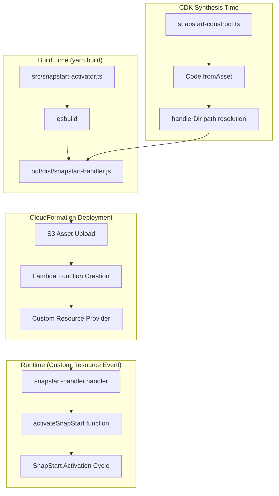

# Design Document: SnapStart Handler Refactor

## Overview

This design describes the refactoring of the SnapStart Custom Resource Handler from inline code generation to a pre-bundled asset approach. The current implementation in `snapstart-construct.ts` contains a `generateHandlerCode()` method that returns ~120 lines of JavaScript as a string literal. This approach has several drawbacks:

1. No TypeScript type-checking for the handler code
2. No IDE support (syntax highlighting, autocomplete, error detection)
3. Logic duplication with `snapstart-activator.ts` which has the same logic with proper types and tests
4. `Code.fromInline()` has size limitations (4KB for inline code)
5. Hardcoded `Runtime.NODEJS_18_X` may not match future Lambda runtime requirements

The refactored approach bundles `snapstart-activator.ts` at build time using esbuild and uses `Code.fromAsset()` to deploy the handler. This provides type safety, IDE support, single source of truth, and removes inline code size limitations.

## Architecture



### Key Design Decisions

1. **Separate esbuild entrypoint**: Add a new build target `snapstartHandler` in `esbuild.config.ts` that bundles `snapstart-activator.ts` independently from the main library bundle.

2. **AWS SDK externalization**: Mark `@aws-sdk/*` as external since these packages are available in the Lambda runtime environment, reducing bundle size.

3. **Path resolution via `__dirname`**: The construct resolves the handler directory relative to its own location in the npm package (`out/dist/`), ensuring it works both in development and when consumed as a dependency.

4. **Handler naming convention**: Output file is `snapstart-handler.js` with handler export `handler`, resulting in Lambda handler string `snapstart-handler.handler`.

## Components and Interfaces

### Build System Changes

#### New Build Target: `snapstartHandler`

Location: `utils/esbuild/esbuild.config.ts`

```typescript
snapstartHandler: {
  entryPoints: ['src/snapstart-activator.ts'],
  outfile: 'out/dist/snapstart-handler.js',
  platform: 'node',
  bundle: true,
  treeShaking: true,
  format: 'cjs',
  target: ['node18'],
  external: [
    '@aws-sdk/client-lambda',
    // All @aws-sdk/* packages available in Lambda runtime
  ],
  label: 'SnapStart Handler',
  minify: true,
}
```

#### Build Pipeline Integration

The `snapstartHandler` target is included in the default build (not filtered by `stageFilters.keys`), ensuring it's built alongside the main CDK library when `yarn build` is executed.

### Construct Changes

#### SnapStartActivator Class Modifications

Location: `src/snapstart-construct.ts`

**Removed**:
- `generateHandlerCode(): string` method (entire ~120 line method)

**Modified**:
- `createProviderFunction()` method to use `Code.fromAsset()` instead of `Code.fromInline()`

```typescript
private createProviderFunction(timeoutSeconds: number, targetFunction: IFunction): LambdaFunction {
  // Resolve path to bundled handler directory
  // __dirname in npm package: node_modules/@lambdakata/cdk/out/dist/
  // Handler location: node_modules/@lambdakata/cdk/out/dist/snapstart-handler.js
  const handlerDir = path.join(__dirname);
  
  const fn = new LambdaFunction(this, 'Handler', {
    runtime: Runtime.NODEJS_18_X,
    handler: 'snapstart-handler.handler',
    code: Code.fromAsset(handlerDir, {
      // Only include the handler file, not the entire dist directory
      exclude: ['*', '!snapstart-handler.js'],
    }),
    timeout: Duration.seconds(timeoutSeconds + 60),
    description: 'Lambda Kata SnapStart Activator - Custom Resource Handler',
    memorySize: 256,
    initialPolicy: [/* unchanged IAM permissions */],
  });

  return fn;
}
```

### Handler Interface

The existing `snapstart-activator.ts` already exports a compatible handler function:

```typescript
// Existing export - no changes needed
export async function handler(event: CustomResourceEvent): Promise<CustomResourceResponse>
```

The handler signature is compatible with the CDK Provider framework:
- Accepts: `CustomResourceEvent` with `RequestType`, `ResourceProperties`, etc.
- Returns: `CustomResourceResponse` with `Status`, `Data`, etc.

### Package Distribution

#### package.json Files Field

```json
{
  "files": [
    "out/dist/**/*",
    "out/tsc/src/**/*.d.ts"
  ]
}
```

The existing `files` field already includes `out/dist/**/*`, so `snapstart-handler.js` will be automatically included in the npm package.

## Data Models

### CustomResourceEvent (Existing)

```typescript
interface CustomResourceEvent {
  RequestType: 'Create' | 'Update' | 'Delete';
  ServiceToken: string;
  ResponseURL: string;
  StackId: string;
  RequestId: string;
  ResourceType: string;
  LogicalResourceId: string;
  PhysicalResourceId?: string;
  ResourceProperties: {
    ServiceToken: string;
    FunctionName: string;
    AliasName?: string;
    SnapshotTimeoutSeconds?: string;
  };
}
```

### CustomResourceResponse (Existing)

```typescript
interface CustomResourceResponse {
  Status: 'SUCCESS' | 'FAILED';
  Reason?: string;
  PhysicalResourceId: string;
  StackId: string;
  RequestId: string;
  LogicalResourceId: string;
  Data?: {
    Version?: string;
    AliasName?: string;
    AliasArn?: string;
    OptimizationStatus?: string;
  };
}
```

### CloudFormation Template Changes

**Before (inline code)**:
```yaml
HandlerFunction:
  Type: AWS::Lambda::Function
  Properties:
    Code:
      ZipFile: |
        const { LambdaClient, ... } = require('@aws-sdk/client-lambda');
        exports.handler = async (event) => { ... }
    Handler: index.handler
```

**After (asset code)**:
```yaml
HandlerFunction:
  Type: AWS::Lambda::Function
  Properties:
    Code:
      S3Bucket: !Ref AssetBucket
      S3Key: !Ref AssetKey
    Handler: snapstart-handler.handler
```


## Correctness Properties

*A property is a characteristic or behavior that should hold true across all valid executions of a system—essentially, a formal statement about what the system should do. Properties serve as the bridge between human-readable specifications and machine-verifiable correctness guarantees.*

Based on the prework analysis, the following properties have been identified for property-based testing:

### Property 1: Asset-Based Code Deployment

*For any* SnapStartActivator construct with valid props, the synthesized CloudFormation template SHALL contain a Lambda function with:
- Code property using S3Bucket/S3Key (asset) instead of ZipFile (inline)
- Handler property set to `snapstart-handler.handler`

**Validates: Requirements 3.2, 3.4, 3.5**

### Property 2: Handler Response Format

*For any* CustomResourceEvent (Create, Update, or Delete), the handler function SHALL return an object containing a `Status` field with value 'SUCCESS' or 'FAILED', not an S3 URL or other response format.

**Validates: Requirements 4.2, 4.3**

### Property 3: Backward Compatible API

*For any* valid SnapStartActivatorProps configuration, the construct SHALL:
- Accept the same props interface (targetFunction, aliasName, snapshotTimeoutSeconds)
- Expose the same output references (versionRef, aliasArnRef, aliasName, resource)
- Generate equivalent IAM permissions for the provider Lambda
- Calculate timeout as snapshotTimeoutSeconds + 60 seconds

**Validates: Requirements 5.1, 5.2**

### Property 4: Handler Bundle Exports

*For any* build of the snapstart-handler.js bundle, the module SHALL export a `handler` function that is callable and returns a Promise.

**Validates: Requirements 1.5, 4.1**

## Error Handling

### Build-Time Errors

| Error Condition | Handling Strategy |
|-----------------|-------------------|
| `snapstart-activator.ts` has syntax errors | esbuild fails with clear error message; build aborts |
| Missing AWS SDK types | TypeScript compilation fails before bundling |
| esbuild configuration error | Build script exits with non-zero code |

### CDK Synthesis Errors

| Error Condition | Handling Strategy |
|-----------------|-------------------|
| Handler bundle not found at `__dirname` | CDK synthesis fails with "ENOENT: no such file or directory" |
| Invalid asset path | CDK throws "Cannot find asset" error |

### Runtime Errors (Custom Resource Handler)

The existing error handling in `snapstart-activator.ts` is preserved:

| Error Condition | Handling Strategy |
|-----------------|-------------------|
| Lambda function not found | Returns FAILED with descriptive error message |
| Insufficient IAM permissions | Returns FAILED with required permissions list |
| SnapStart snapshot creation fails | Logs warning, creates alias pointing to latest version |
| Error during Update request | Returns SUCCESS to prevent rollback deadlock |
| Error during Create request | Returns FAILED, CloudFormation rolls back |

## Testing Strategy

### Dual Testing Approach

This refactoring requires both unit tests and property-based tests:

- **Unit tests**: Verify specific examples like file existence, template structure, handler exports
- **Property tests**: Verify universal properties across all valid inputs using fast-check

### Test Categories

#### 1. Build Verification Tests (Unit)

Location: `test/snapstart-handler-build.test.ts` (new file)

```typescript
describe('snapstart-handler build', () => {
  it('should produce snapstart-handler.js in out/dist/', () => {
    const handlerPath = path.join(__dirname, '../out/dist/snapstart-handler.js');
    expect(fs.existsSync(handlerPath)).toBe(true);
  });

  it('should export a handler function', () => {
    const handler = require('../out/dist/snapstart-handler');
    expect(typeof handler.handler).toBe('function');
  });

  it('should not bundle AWS SDK', () => {
    const content = fs.readFileSync(
      path.join(__dirname, '../out/dist/snapstart-handler.js'),
      'utf-8'
    );
    // AWS SDK should be required, not bundled
    expect(content).toContain('require("@aws-sdk/client-lambda")');
  });
});
```

#### 2. Construct Template Tests (Unit + Property)

Location: `test/snapstart-construct.test.ts` (modified)

**Modified expectations**:
- Change assertions from `Code.ZipFile` to `Code.S3Bucket`/`Code.S3Key`
- Update handler assertion from `index.handler` to `snapstart-handler.handler`

**Property test** (using fast-check):
```typescript
// Feature: snapstart-handler-refactor, Property 1: Asset-Based Code Deployment
it.prop([fc.record({
  aliasName: fc.string({ minLength: 1, maxLength: 128 }),
  snapshotTimeoutSeconds: fc.integer({ min: 60, max: 600 }),
})])('should use asset-based code for any valid props', (props) => {
  const { stack } = createTestStack();
  const targetFunction = createTestLambda(stack, 'Target');
  
  new SnapStartActivator(stack, 'SnapStart', {
    targetFunction,
    ...props,
  });
  
  const template = Template.fromStack(stack);
  const lambdas = template.findResources('AWS::Lambda::Function', {
    Properties: { Description: Match.stringLikeRegexp('SnapStart') }
  });
  
  const handler = Object.values(lambdas)[0];
  expect(handler.Properties.Code.S3Bucket).toBeDefined();
  expect(handler.Properties.Code.S3Key).toBeDefined();
  expect(handler.Properties.Handler).toBe('snapstart-handler.handler');
});
```

#### 3. Handler Response Tests (Property)

Location: `test/snapstart-activator.property.test.ts` (existing, may need additions)

```typescript
// Feature: snapstart-handler-refactor, Property 2: Handler Response Format
it.prop([
  fc.oneof(
    fc.constant('Create'),
    fc.constant('Update'),
    fc.constant('Delete')
  )
])('should return object with Status field for any request type', async (requestType) => {
  const event = createMockEvent(requestType);
  const response = await handler(event);
  
  expect(response).toHaveProperty('Status');
  expect(['SUCCESS', 'FAILED']).toContain(response.Status);
  expect(typeof response).toBe('object');
});
```

#### 4. Backward Compatibility Tests (Property)

Location: `test/snapstart-construct.test.ts` (modified)

```typescript
// Feature: snapstart-handler-refactor, Property 3: Backward Compatible API
it.prop([fc.record({
  aliasName: fc.option(fc.string({ minLength: 1, maxLength: 128 })),
  snapshotTimeoutSeconds: fc.option(fc.integer({ min: 60, max: 600 })),
})])('should preserve API contract for any valid props', (props) => {
  const { stack } = createTestStack();
  const targetFunction = createTestLambda(stack, 'Target');
  
  const activator = new SnapStartActivator(stack, 'SnapStart', {
    targetFunction,
    ...props,
  });
  
  // API contract verification
  expect(activator.aliasName).toBeDefined();
  expect(activator.versionRef).toBeDefined();
  expect(activator.aliasArnRef).toBeDefined();
  expect(activator.resource).toBeDefined();
  
  // Timeout calculation
  const expectedTimeout = (props.snapshotTimeoutSeconds ?? 180) + 60;
  const template = Template.fromStack(stack);
  const lambdas = template.findResources('AWS::Lambda::Function', {
    Properties: { Description: Match.stringLikeRegexp('SnapStart') }
  });
  const handler = Object.values(lambdas)[0];
  expect(handler.Properties.Timeout).toBe(expectedTimeout);
});
```

### Property-Based Testing Configuration

- **Library**: fast-check (already in devDependencies)
- **Minimum iterations**: 100 per property test
- **Tag format**: `Feature: snapstart-handler-refactor, Property N: {property_text}`

### Existing Tests (No Modification Required)

The following test files should continue to pass without changes:
- `test/snapstart-activator.test.ts` - Handler logic tests
- `test/snapstart-activator.property.test.ts` - Handler property tests

### Test Execution

```bash
# Run all tests
yarn test

# Run specific test file
yarn test snapstart-construct.test.ts

# Run with coverage
yarn test --coverage
```

### Verification Checklist

1. `yarn build` succeeds and produces `out/dist/snapstart-handler.js`
2. `yarn test` passes all existing and new tests
3. `yarn lint` reports no errors
4. `npm pack --dry-run` shows `snapstart-handler.js` in package contents
5. CDK synth produces template with asset-based Lambda code
